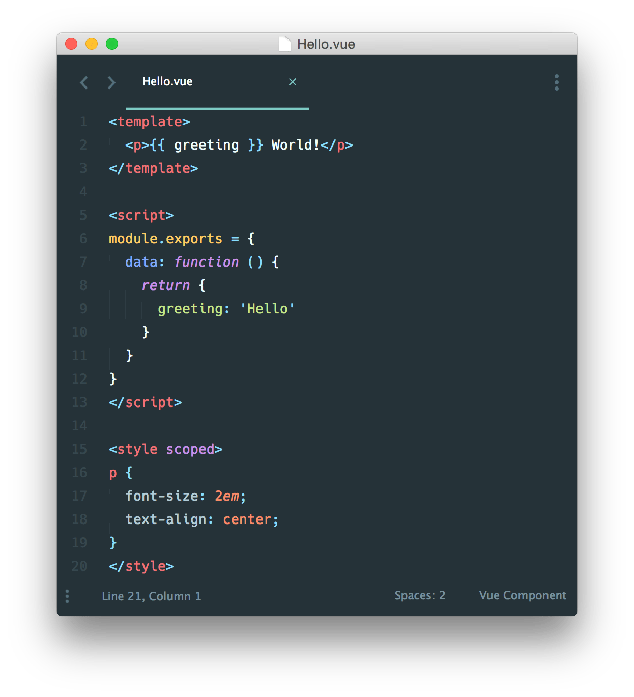

# 👨‍🎓 Vue Avanzado

Ahora que ya sabemos los conceptos basicos de Vue, vamos a aprender a crear aplicaciones web mas profesionales. Hasta ahora vimos que implementar el framework es muy facil, simplemente tenemos que agregar la libreria y crear nuestra instancia con `new Vue({})`. El asunto es que en la mayoria de los casos vamos a querer hacer aplicaciones mas complejas en lugar de prototipos o cosas basicas.

Recordemos que Vue esta basado en un concepto progresivo y que a medida que nuestra aplicacion incremente la complejidad podemos acompañar ese proceso con herramientas o librerias que nos permitan trabajar de manera mas optima.

## Componentes en Archivos (`.vue`)

Lo primero que vamos aprender ahora es la *magia* de los archivos `.vue`. Esto nos permite crear componentes en archivos (1 componente = 1 archivo) y escribir todo codigo, vista y estilo que pertenece a ese componente.

La estructura de un archivo `.vue` es la siguente:

Como ven es muy intuitivo, usamos el tag `template` para HTML, `script` para JS y `style` para CSS.
Las ventajas de los archivos `.vue` son las siguientes:

1. Facilitamos el manejo de codigo HTML en cada componente ya que no usamos mas una variable `string`.
2. Podemos agregar estilos (CSS) especificos para nuestros componentes.
3. Nos permiten integrar preprocesadores como [Bebel](), [SASS]() y [Pug]().

Si bien los archivos `.vue` son geniales para los desarrolladores, tenemos un pequeño problema. El browser no soporta este tipo de archivos 😅

Para poder utilizarlos vamos a tener que incorporar algun sistema de *build*. Esto quiere decir que nosotros como programadores vamos a codear nuestra aplicacion en componentes dentro de archivos `.vue` pero con la ayuda de herramientas como [Webpack]() o [Browserify](), nuestro codigo se va a compilar en archivos (generalmente `.js`) que el browser puede interpretar.

En general este proceso de compilacion tiende a ser un poco mas complejo y esta fuera del alcance de este workshop. Por el momento lo que hagan estas herramientas es una **caja negra** para nosotros, pero lo que es seguro es que pueden interpretar **todos** los archivos `.vue` y generar uno o mas archivos con formato y codigo compatible para el browser.

Una desventaja de utilizar estas herramientas de *build* es el tiempo que nos lleva tener que aprender a usarlas y configurarlas. Por suerte Vue nos ofrece una manera de no tener que lidiar con esto y vamos a verlo en la siguiente seccion.
