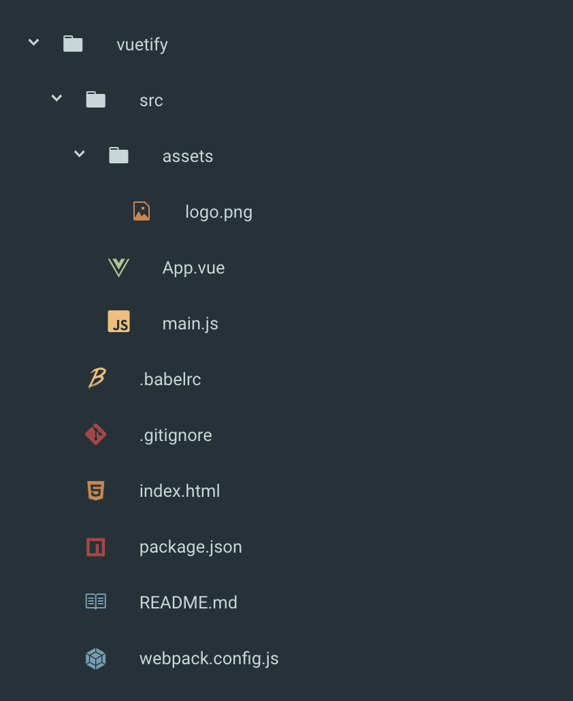

# 🖥 CLI

Un CLI (*Command Line Interface*) es una pequeña utilidad o aplicacion que nos permite interactuar con un programa a traves de comandos o instrucciones. Cuando usamos [npm]() para instalar una libreria, estamos usando un CLI.

Vue tiene su propio CLI ([vue-cli](https://github.com/vuejs/vue-cli)), el cual tiene un proposito muy simple: servir como generador de aplicaciones. Nos permite crear todo el *set up* inicial de nuestros proyectos basandose en diferentes tipos de templates. Lo bueno de esta utilidad es que no solo crea todos los archivos necesarios sino que tambien se encarga de configurar todas las herramientas y librerias que el template establece.

En nuestro caso vamos a usar Webpack y como les prometi antes vamos a dejar que Vue se encargue de hacerlo funcionar por nosotros.

## vue-cli
El CLI de Vue esta desarrollado en node y es parte del repositorio public de npm por lo cual podemos instalarlo simple y de manera global para usando en nuestra terminal de comandos.

1. Abrimos una terminal
2. Instalamos `vue-cli` usando npm (recuerden que el *flag* `-g` indica instalacion global)
```bash
$ npm install -g vue-cli
```
3. Usando la terminal navegamos hasta el directorio donde queramos crear nuestra aplicacion usando el comando `cd`.
4. Creamos nuestro proyecto usando el comando `vue init [template] [nombre de proyecto]`:
```bash
$ vue init webpack-simple vuetify
```


> `webpack-simple` es el nombre del template que vamos a utilizar y `vuetify` es el nombre de nuestro proyecto.

Una vez finalizado esto y si no tuvimos ningun tipo de error podemos ver que el CLI nos genero un proyecto con la siguiente estructura:



## npm run dev

Si nunca usaron npm scripts pueden chequear como se comportan en la [documentacion](https://docs.npmjs.com/misc/scripts). Mientras tanto podemos describirlos como comandos personalizados que nos permiten (entre otras cosas) disponer de las herramientas o librerias de npm (locales) en nuestra terminal.

> Todos los scripts de npm los ejecutamos con el comando `npm run [nombre de script]`. A excecpcion de los comandos `test` y `start` donde podemos omitir el uso de `run`.

Estos comandos se describen en el archivos `package.json`. Este archivo contiene toda la metadata de nuestro proyecto, los scripts y todas las dependencias que utilizo. Al contar con toda esta informacion, este archivo me permite tener un ambiente de desarrollo reproducible en cualquier computadora.

Si inspeccionamos el `package.json` creado por el CLI nos encontramos con dos scripts:

```json
"scripts": {
  "dev": "cross-env NODE_ENV=development webpack-dev-server --open --hot",
  "build": "cross-env NODE_ENV=production webpack --progress --hide-modules"
},
```

1. `dev` ➡️ Incia nuestra aplicacion en modo de desarrollo utilizando webpack
2. `build` ➡️ Compila nuestra aplicacion lista para llevar a produccion.

Es momento de iniciar nuestra aplicacion y para eso nos quedan 2 cosas por hacer:

1. Volvemos a la terminal (siempre posicianados en el path del proyecto) y ejecutamos `$ npm install`. Este comando instala todas las dependencias del `package.json` en nuestra computadora.

2. Una vez que la instalacion finalizo vamos a usar `$ npm run dev` para iniciar nuestra aplicacion.


Listo, ya tenemos todo lo que necesitamos para empezar a trabajar con Vue de forma profesional.
