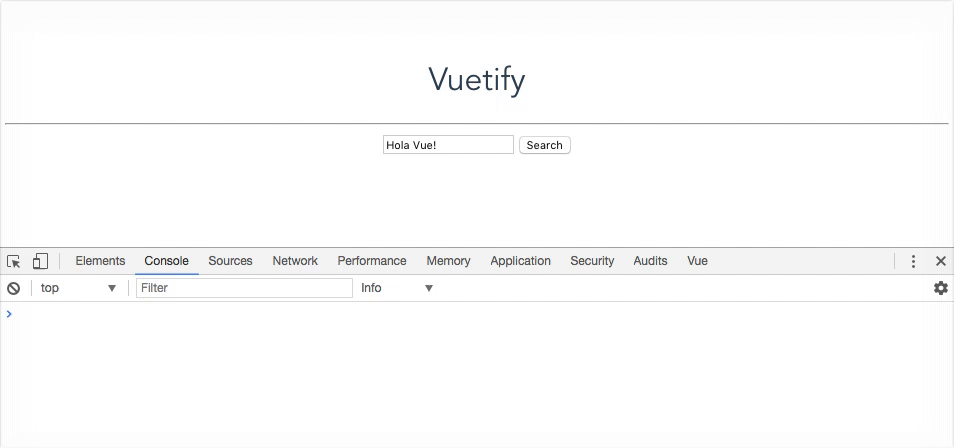

# 🔎 Search Component

Vamos a crear nuestro propio componente en un nuevo archivo `.vue` que vamos a luego integrar con el componente principal `App.vue`. Dentro de este nuevo componente vamos a hacer uso del metodo `search` de nuestro servicio `spotify`.


## `Search.vue`

1. Para organizar mejor nuestra apliacion vamos a crear dentro de `src` una carpeta llamada `components` donde de ahora en mas vamos a guardar dentro todos los componentes que creemos. Esto es simplemente para seguir mejorando la organizacion de nuestra aplicacion y que el `App.vue` quede separado del resto. Una vez hecho esto creamos nuestro componente `Search.vue` ➡️ `src/components/Search.vue`

> Es una buena practica mantener los nombres de los componentes en *PascalCase*, para el resto de los archivos vamos a utilizar siempre *kebab-case*.

2. Abrimos el archivo que creamos y le agreamos la siguente estructurada base:

```html
<template lang="html">  
  <div> <!-- ⚠️ Este div es importante: todos los componentes deben tener un unico elemento principal -->
    <input type="text">
    <button type="button">Search</button>

    <ul>
      <li></li>
    </ul>
  </div>>
</template>

<script>
  export default {
    name: 'Search'
  }
</script>
```

3. Ya es momento de empezar a utilizar los conceptos que aprendimos sobre Vue. Vamos a realizar las siguientes tareas dentro de `Search.vue`:
  * Creamos la funcion `data` (recuerden que devuelve un objeto). Con una propiedad llamada `query` y la inicializamos con un `String` vacio. Tambien agregamos otra propiedad con el nombre `results` y le asignamos un `Array` vacio.
  * Creamos el objeto `methods` y agregamos una funcion con el nombre `search`. Por el momento esta funcion permanece vacia o bien pueden agregarle un `console.log()` para testear luego.
  * En la parte HTML definimos un `input`, necesitamos relacionarlo a la propiedad `query` de nuestro componenente usando `v-model`.
  * Seguimos en el HTML, tenemos que usar `v-on` (o `@`) para que cada vez que hagamos click en el boton "Search" se ejecute nuestro metodo `search`.
  * Por ultimo podemos modificar nuestro metodo `search` para que con un `console.log` mostremos el valor de la propiedad `query`. Recuerden de que manera podemos acceder a las propiedads dentro de los metodos.


4. Ya tenemos la estructura base de nuestro componente. Nos falta insertarlo en nuestra aplicacion. Para eso tenemos que importarlo en el componente donde queremos utilizarlo. En nuestro caso `App.vue`. Aprovechamos tambien para limpiar el componente y sacar todo lo que genera el CLI a modo de ejemplo:

```html
<template>
  <div id="app">
    <h1>Vuetify</h1>
    <hr>

    <search></search> <!-- insertamos el componente search -->
  </div>
</template>

<script>
  // Importamos el componente de search
  import Search from './components/Search.vue'

  export default {
    name: 'app',

    // Le indicamos al component App que puede disponer de un componente llamado Search
    components: { Search }
  }
</script>
```

> `components: { Search }` esta sintaxis se corresponde con ES2015 y equivale a hacer `components: { Search: Search }`. El nombre de la propiedad es el nombre con el que luego podemos escribir el tag en HTML. Por ejemplo, si escribimos `components: { Buscar: Search }`, en HTML represantariamos nuestro tag como `<buscar></buscar>`.

> En el caso que sea un component con mas de una palabra la manera correcta de declararlo seria: `components: { AcaBuscamos: Search }` y luego en HTML `<aca-buscamos></aca-buscamos>`. Vue se encargar de parsear la sinxtaxis *PascalCase* de JS y usarla como *kebab-case* en HTML.

Es momento de probar si nuestro codigo funciona. Recuerden que no es necesario reiniciar la aplicacion ni volver a ejecutar el comando `npm run dev` (salvo que lo hayamos interrumpido nosotros). Podemos refrezcar el browser y testear clickeando que el boton de "Search".



___
### 📝 [Resolución](https://github.com/ianaya89/workshop-vuejs/blob/master/hints/09.md)
