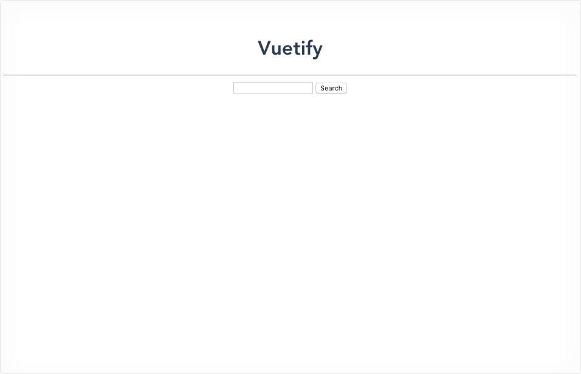

# `Search.vue` + `spotify.js`

Tenemos nuestro componente listo y tambien nuestra logica para obtener data de la API. Es momento de combinar ambas cosas.

## `Search.vue`

1. Volvemos a nuestro componente `Search`. Como se imaginan, para poder usar el servicio de spotify debemos primero importar el modulo.

2. Una vez hecho eso podemos reemplazar el contenido del metodo `search` para que interactue con el metodo del servicio de spotify (tambien llamado `search`). Recordemos que este ultimo metodo (que usa Fetch) retorna una *Promise*, por lo cual podemos manejar la respuesta de la API atraves de una funcion `.then()`

```html
<script>
  import spotify from '../services/spotify'

  export default {
    name: 'Search',

    data () {
      return {
        query: '',
        results: []
      }
    },

    methods: {
      search () {
        // Hardcodeamos el parametro type con el valor "artist"
        spotify.search(this.query, 'artist')
          .then(res => console.log(res))
      }
    }
  }
</script>
```

> El segundo parametro `spotify.search()` es el tipo de contenido que queremos buscar, por el momento vamos a *hardcodear* el valor "artist" pero mas adelante lo haremos dinamico.

Podemos testear si funciona de la misma manera que antes, la difrencia es que ahora deberiamos ver en consola la respuesta de la API.


3. Ahora que tenemos la respuesta de la API podemos ver que recibimos un objeto con una propiedad `artists` que a su vez tiene una propieda `items` de tipo `Array`. Vamos a modificar el callback de la funcion `.then()` para que podamos asociar asignar el valor `items` a nuestra propiedad `results` del `vm`.

4. Para mostrar los resultados de la busqueda en nuestro HTML, nos queda usar un `v-for` que pueda iterar cada elemento de `results` y definir un template apropiado para visualizar la data.

> Pueden definir el markup como mas les guste en base a las propiedades del artista que quieran mostrar pueden compararlo luego con la solucion.

5. Por ultimo vamos a agregar un poco de CSS, tambien son libres de elegir los estilos que les gusten en base al template que elegieron, la unica regla es agregar el siguiete tag `style` con el atribute `scoped`.

```html
<style scoped>
  /* Aca los estilos */
</style>
```

El atributo `scoped` nos permite restringir el alcance de las reglas CSS que definamos en nuestros selectores. Al usar este atributo todos nuestros estilos definidos en el componente, solamente afectaran a los elementos HTML definidos dentro de este componenete.




___
### 🤓 Extras

1. Podemos agregar un mensaje que diga "No se encontraron resultados" cuando `results.length === 0`. Para este caso podemos usar `v-show`.

2. Podemos agregar un boton para reiniciar la busqueda. Para esto podemos utilizar un metodo (que reestablezca los valores de `query` y `results`) y una directiva `v-on` (o `@`).

### 📝 [Resolución](https://github.com/ianaya89/workshop-vuejs/blob/master/hints/10.md)
