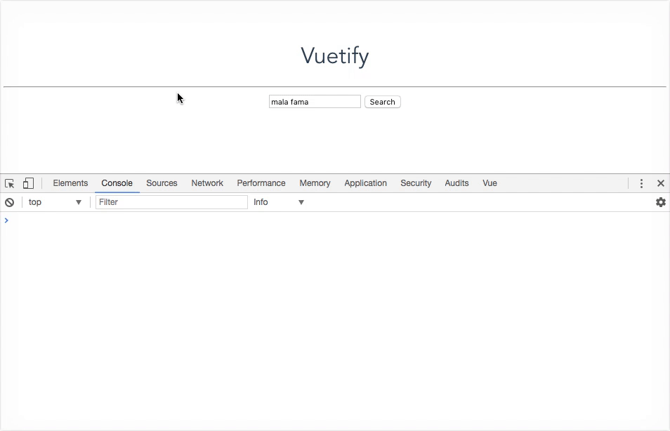

# `Search.vue` + `spotify.js`

Tenemos nuestro componente listo y tambien nuestra logica para obtener data de la API. Es momento de combinar ambas cosas.

# Search.vue

1. Volvemos a nuestro componente `Search`. Como se imaginan, para poder usar el servicio de spotify debemos primero importar el modulo.

2. Una vez hecho eso podemos reemplazar el contenido del metodo `search` para que interactue con el metodo del servicio de spotify (tambien llamado `search`). Recordemos que este ultimo metodo (que usa Fetch) retorna una *Promise*, por lo cual podemos manejar la respuesta de la API atraves de una funcion `.then()`

```html
<script>
  import spotify from '../services/spotify'

  export default {
    name: 'Search',

    data () {
      return {
        query: '',
        results: []
      }
    },

    methods: {
      search () {
        // Hardcodeamos el parametro type con el valor "artits"
        spotify.search(this.query, 'artist')
          .then(res => console.log(res))
      }
    }
  }
</script>
```

> El segundo parametro `spotify.search()` es el tipo de contenido que queremos buscar, por el momento vamos a *hardcodear* el valor "artist" pero mas adelante lo haremos dinamico.

Podemos testear si funciona de la misma manera que antes, la difrencia es que ahora deberiamos ver en consola la respuesta de la API.


