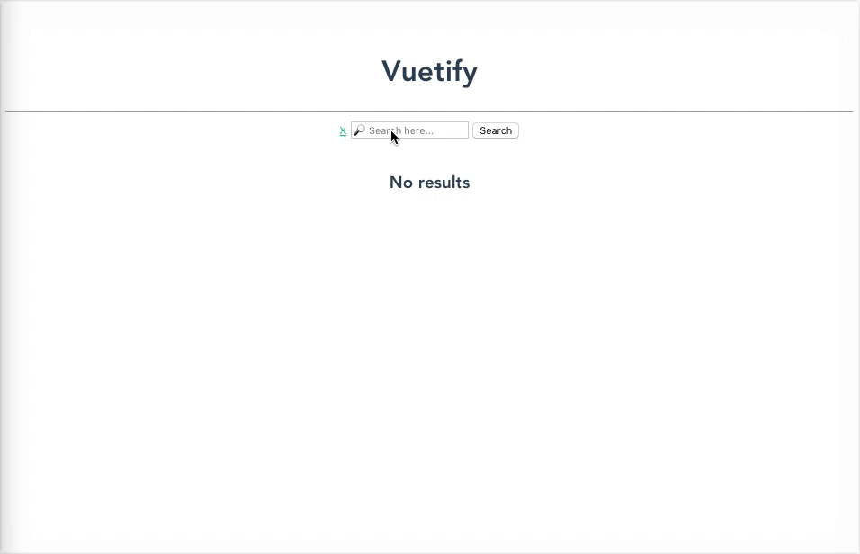

# *Event Modifiers*

En determinados eventos podemos necesitar cierto compartamiento exclusivo de los eventos como llamar a la funcion `preventDefault` o chequear el el `keycode` de la tecla que se apreto. Vue nos ofrece una alternativa interesanta para lidiar con este de forma mas sencilla

## `.prevent`

Vamos a agregar al componente `Search`, funcionalidad para reiniciar la busqeda:

1. Agregamos a nuestro objeto `methods` una nueva funcion llamada `reset`. Dentro de esta vamos a reestablecer los valores defaults de `results` y `query`.

2. Luego agregamos un tag `<a>` en nuestro HTML al cual vamos *linkear* con el metodo `reset` al momento de hacer click. Para este caso vamos a usar de nuevo la directiva `v-on` (o `:@`) pero le vamos a agregar el *modifier* `prevent` el cual equivale al tradicional `e.preventDefault()`. De esta manera evitamos que se dispare el compartamiento nativo del tag.

```html
  <a href="#" @click.prevent="reset">x</a>
```

## `.enter`

Para mejorar la UX de nuestra aplicación, vamos a permitir que la busqueda se pueda disparar cuando el usuario presione la tecla *enter* y tenga el foco puesto en el `input` de busqueda. Recuerden que usando `v-on` podemos escuchar cualquier tipo de evento que el elemento HTML disponga.

1. En este caso vamos a usar `v-on` en el evento `keyup` (en el elemento `input`). Para este evento Vue nos ofrece *modifiers* que nos permiten restringirlo a una tecla espcefica sin que nosotros tengamos que estar chequeando el `keycode` en el codigo. Usando la misma notacion que en el punto anterior *linkeamos* el evento con el modifier `.enter` (al metodo `search`).



___
### 📝 [Resolución](https://github.com/ianaya89/workshop-vuejs/blob/master/hints/11.md)
